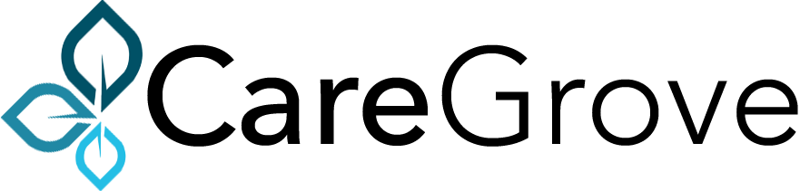
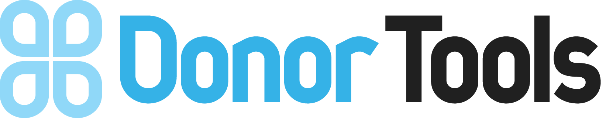

## 👋Hi, my name is Ryan Heneise.

I'm an entrepreneur and principal full-stack software engineer and Shape Up project manager. I love making things, especially on the web. With over twenty years experience developing web applications, I've been involved in all aspects of the product delivery cycle. 

A few of the companies that I've had the pleasure of working with: 

  
<a href="https://boosterstage.com/">
    
  </a>

  
<a href="https://memberdrive.org/">
    
  </a>

  
<a href="https://boosterstage.com/portfolio/dime-giving/">
    
  </a>

  

  

  

  <!-- 

 -->

I fall into the category of "Ruby on Rails Developer". Ever since learning about Ruby on Rails when it first come out, I've been in love with Rails, and by extension, the 37Signals/Basecamp way of doing things. 

A few years ago I started my own web development agency, called [Booster Stage](https://boosterstage.com). Since I was the boss of applesauce, I was able to implement a variation of the [Shape Up](https://basecamp.com/shapeup) project methodology for clients with great success. Clients love Shape Up because it helps to reduce risk by shipping big things fast. Developers love Shape Up because it helps to focus deliverables and provides generous but well-defined timeframes.

## Current Projects

- **MemberDrive** &hellip; [memberdrive.org](https://memberdrive.org)\
  MemberDrive is an innovative crowdfunding platform that helps organizations turn donors into engaged members. Members ❤️ MemberDrive.
- **Saint Joseph the Worker Capital Campaign** &hellip; [traditionandbeauty.com](https://traditionandbeauty.com)\
  Serving as a member of the fundraising committee.
- **Ragtime Ranch Family Farm** &hellip; [ragtimeranch.substack.com](https://ragtimeranch.substack.com)

## Recent Work History

- <strong class="text-red-500">Currently:</strong> Principal Software Engineer at **Gierd, Inc.**\
  [gierd.com](https://gierd.com)

- **Senior Software Engineer** at **SRS Acquiom**\
  [srsacquiom.com](https://srsacquiom.com)

- **Senior Full Stack Engineer** at **Swan Bitcoin**\
  Building swanbitcoin.com.\
  [swanbitcoin.com](https://swanbitcoin.com)

- **Lead Developer** at **Dime Giving**\
	Designed and built DimeGiving.com, an online donation platform backed by double-entry accounting backend. \
	[dimegiving.com](https://dimegiving.com)

- **Founder and Product Manager** at **Booster Stage**\
  Launched and grew a web development agency, providing outstanding value to clients in need of rapidly-deployed custom web-based software solutions.\
  [boosterstage.com](https://boosterstage.com)

- **Founder and Developer** at **Donor Tools**\
  Designed and built DonorTools.com, one of the first modern web-based donor management and online donations systems for nonprofit organizations. \
  [donortools.com](https://donortools.com)

For more work history, check out my [Resume](./resume), and connect with me on [LinkedIn](https://www.linkedin.com/in/heneise)
